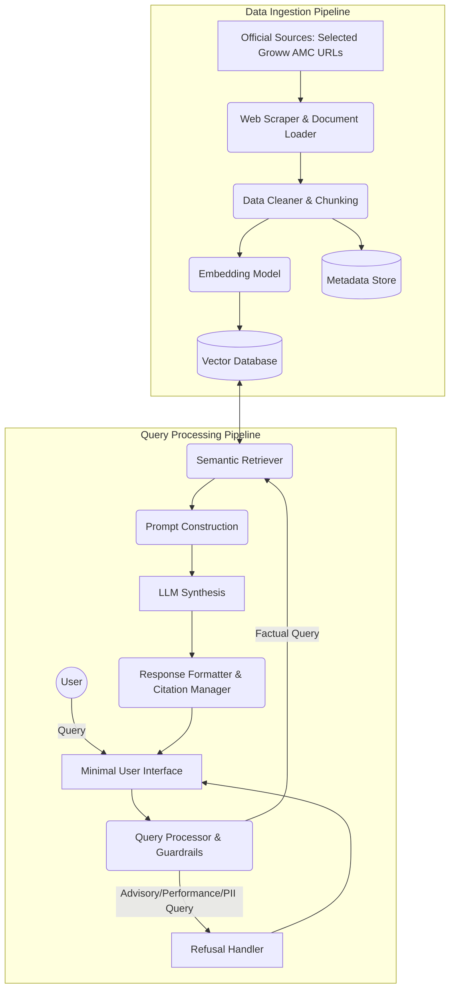

# Architecture Document: Mutual Fund FAQ Assistant (Facts-Only RAG)

## 1. System Overview
The Mutual Fund FAQ Assistant is a Retrieval-Augmented Generation (RAG) system designed to provide objective, verifiable, and source-backed answers to mutual fund queries. The architecture prioritizes accuracy, compliance (no investment advice), and transparency over conversational flexibility. 

## 2. High-Level Architecture

The architecture consists of two main pipelines:
1. **Data Ingestion Pipeline (Offline):** Responsible for fetching, processing, embedding, and storing official mutual fund documents.
2. **Query Processing Pipeline (Online):** Responsible for handling user queries, retrieving relevant facts, enforcing guardrails, and generating the final response.

## 3. Core Components

### 3.1. Data Ingestion Pipeline
- **Web Scrapers:** Scripts to systematically scrape the provided Groww URLs for the 10 selected AMCs (HTML content only). No PDFs or other document formats will be ingested.
- **Text Extraction & Chunking:** Parses unstructured HTML text and tables. Chunks the text into smaller, meaningful segments (e.g., 500 tokens with 50-token overlap) while preserving the hierarchical context (Page Title, URL, Date).
- **Embedding Model:** A dense embedding model to convert text chunks into high-dimensional vector representations.
- **Vector Database:** Stores the embeddings for fast semantic similarity search.
- **Metadata Store:** Stores the raw text, source URL, and extraction date linked to each vector. This is critical for providing exact citations.

### 3.2. Query Processing & Guardrails
- **Input Guardrails (Classification):** A lightweight classifier or LLM router that inspects the user query before processing.
  - *Advisory/Subjective:* E.g., "Which is better?", "Should I buy?". Triggers the **Refusal Handler** (polite refusal + educational link).
  - *Performance/Return Calculation:* E.g., "What is the return for 5 years?". Triggers the **Refusal Handler** (redirects to the official factsheet link).
  - *Factual:* E.g., "What is the exit load?". Proceeds to retrieval.
- **Privacy Filter:** Uses regex or NER (Named Entity Recognition) to ensure no PII (PAN, Aadhaar, account numbers, OTPs, emails) is passed to the LLM. If PII is detected, the query is blocked.

### 3.3. RAG Pipeline (Retrieval & Synthesis)
This section forms the core of the Retrieval-Augmented Generation (RAG) process.
- **Semantic Retriever:** Converts the factual user query into an embedding and performs a Top-K similarity search in the Vector Database.
- **Prompt Construction:** The retrieved context chunks are injected into a strict system prompt.
  - *System Prompt Directives:*
    1. Answer ONLY using the provided context.
    2. Do not hallucinate or use external knowledge.
    3. Limit the response to a maximum of 3 sentences.
    4. Provide the answer in a highly factual tone.
- **LLM Synthesis:** The core Large Language Model generates the answer strictly based on the prompt constraints.

### 3.4. Response Formatter & Citation Manager
Ensures the final output perfectly aligns with the constraints defined in the problem statement:
1. Validates that the LLM response is within the 3-sentence limit.
2. Extracts the metadata from the winning chunk to append exactly **one** primary citation link.
3. Appends the mandatory footer: `"Last updated from sources: <date>"`.

### 3.5. Minimal User Interface
A lightweight frontend featuring:
- A clear welcome message.
- 3 clickable example factual questions.
- A persistent, highly visible disclaimer prominently displayed: **"Facts-only. No investment advice."**

## 4. Technology Stack (Recommended)
- **Programming Language:** Python
- **Orchestration Framework:** LangChain or LlamaIndex
- **Data Ingestion:** BeautifulSoup (HTML only)
- **Vector Database:** ChromaDB (Local/Lightweight) or Pinecone/Qdrant
- **LLM & Embeddings:** Groq API (for LLM) and BGE Model (for Embeddings)
- **Frontend UI:** Streamlit or Gradio for rapid, minimal deployment

## 5. Security & Compliance Enforcement
1. **Source Isolation:** The vector database is strictly populated with curated, whitelisted domains. Third-party blogs or aggregators are explicitly excluded during the ingestion phase.
2. **Zero PII Retention:** The application operates completely statelessly regarding user identity. No login is required. No databases are configured to log sensitive identifiers.
3. **Advisory Evasion:** Guardrails are placed at the entry point of the application to catch and drop advisory intent before it ever reaches the generative model, ensuring 100% compliance with SEBI guidelines regarding unregistered investment advice.
